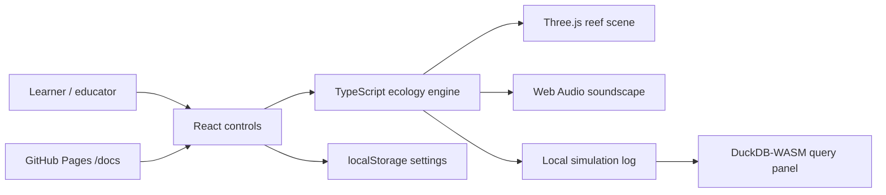

# Coral Reef Ecology Simulator


Live site:

https://baditaflorin.github.io/coral-reef-ecology-simulator/

Repository:

https://github.com/baditaflorin/coral-reef-ecology-simulator

Support:

https://www.paypal.com/paypalme/florinbadita

An interactive reef simulator where species, climate stress, visuals, and sound reveal trophic cascade dynamics.


## What It Does

Coral Reef Ecology Simulator is a fully static climate education app. Drop fish, coral, and algae species into a living reef model, tune temperature and pH, watch trophic cascades unfold in a Three.js reef scene, and turn on a Web Audio soundscape that changes as biodiversity and stress shift.

The app shows the current version and source commit directly on the GitHub Pages page, and it links back to the repository so visitors can star it if they like it.

## Quickstart

```sh
npm install
make install-hooks
make dev
make test
make smoke
```

## Architecture



## Tech Stack

- React, TypeScript strict, Vite, Tailwind CSS.
- Custom multi-agent ecology engine with deterministic trophic interactions.
- Three.js rendering with WebGPU capability probing and WebGL fallback.
- Web Audio procedural underwater soundscape.
- DuckDB-WASM lazy-loaded for local simulation log analysis.
- Static species data served from `/data/v1/`.

## Project Docs

Architecture:

https://github.com/baditaflorin/coral-reef-ecology-simulator/blob/main/docs/architecture.md

ADRs:

https://github.com/baditaflorin/coral-reef-ecology-simulator/tree/main/docs/adr

Data contract:

https://github.com/baditaflorin/coral-reef-ecology-simulator/blob/main/docs/data.md

Deployment:

https://github.com/baditaflorin/coral-reef-ecology-simulator/blob/main/docs/deploy.md

Privacy:

https://github.com/baditaflorin/coral-reef-ecology-simulator/blob/main/docs/privacy.md

Postmortem:

https://github.com/baditaflorin/coral-reef-ecology-simulator/blob/main/docs/postmortem.md
