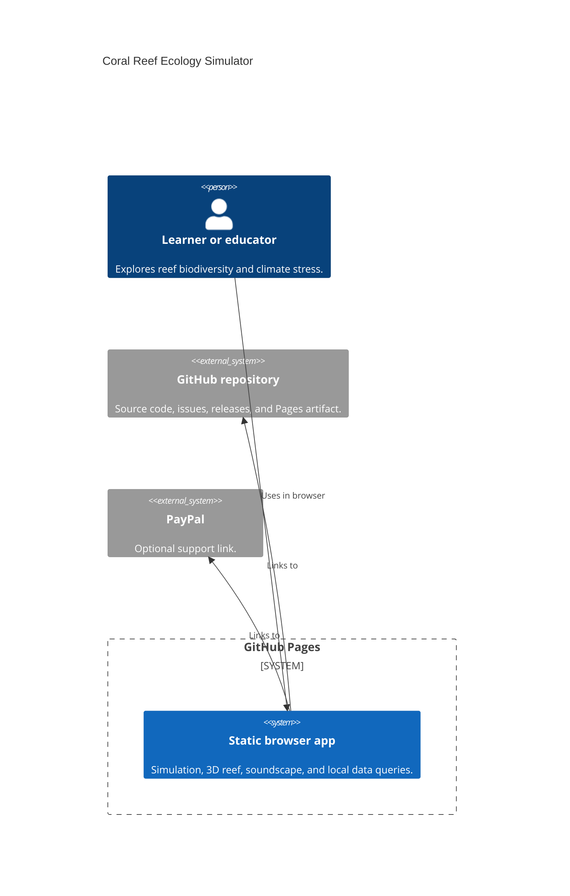
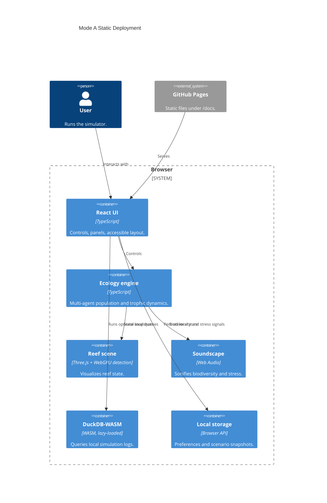

# Architecture

## Context

```mermaid
C4Context
  title Coral Reef Ecology Simulator
  Person(learner, "Learner or educator", "Explores reef biodiversity and climate stress.")
  System_Boundary(pages, "GitHub Pages") {
    System(app, "Static browser app", "Simulation, 3D reef, soundscape, and local data queries.")
  }
  System_Ext(github, "GitHub repository", "Source code, issues, releases, and Pages artifact.")
  System_Ext(paypal, "PayPal", "Optional support link.")
  Rel(learner, app, "Uses in browser")
  Rel(app, github, "Links to")
  Rel(app, paypal, "Links to")
```

## Container

```mermaid
C4Container
  title Mode A Static Deployment
  Person(user, "User", "Runs the simulator.")
  System_Boundary(browser, "Browser") {
    Container(ui, "React UI", "TypeScript", "Controls, panels, accessible layout.")
    Container(engine, "Ecology engine", "TypeScript", "Multi-agent population and trophic dynamics.")
    Container(scene, "Reef scene", "Three.js + WebGPU detection", "Visualizes reef state.")
    Container(audio, "Soundscape", "Web Audio", "Sonifies biodiversity and stress.")
    Container(db, "DuckDB-WASM", "WASM, lazy-loaded", "Queries local simulation logs.")
    Container(storage, "Local storage", "Browser API", "Preferences and scenario snapshots.")
  }
  System_Ext(pages, "GitHub Pages", "Static files under /docs.")
  Rel(user, ui, "Interacts with")
  Rel(ui, engine, "Controls")
  Rel(engine, scene, "State snapshots")
  Rel(engine, audio, "Biodiversity and stress signals")
  Rel(ui, db, "Runs optional local queries")
  Rel(ui, storage, "Persists local state")
  Rel(pages, ui, "Serves")
```
